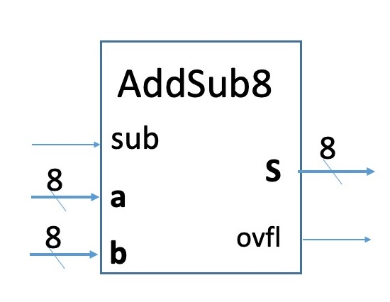
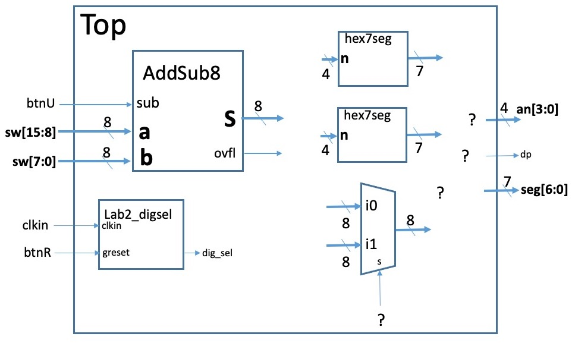
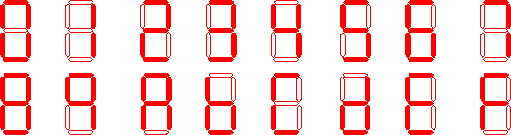
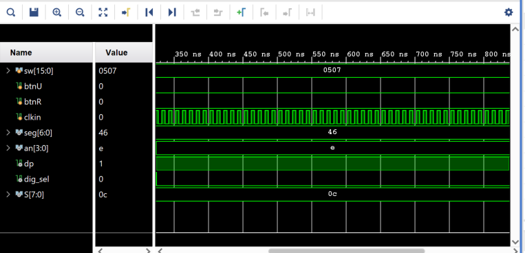

CSE100 Lab 2  
Martine Schlag  
Winter 2024
-----

**Prelab due:** Tuesday January 16 9am PST

**Demo due:** Thursday January 18 end of your section

Be sure to complete the [prelab](https://classes.soe.ucsc.edu/cse100/Winter24/lab/lab2/prelab2.html) before beginning this assignment.

In this lab you will implement

*   an 8-bit adder,
*   a 2-to-1 multiplexer for 8 bit buses,
*   a hex to 7segment encoder,
*   and an 8-bit adder/subtractor.

These components will be used to implement an an adder/subtractor component with inputs from the switches and pushbutton btnU.  
The output of the adder/subtractor will be displayed on the the right two digits of the 7 segment display.  
You will also learn to use bit vectors in Verilog (aka buses) and simulate your design.  
(In the pre-lab you read [Vectors and Buses in Verilog](https://classes.soe.ucsc.edu/cse100/Winter24/lab/buses/bus.html) and answered questions about buses.)

The adder/subtractor (symbol below) is a combinational circuit that calculates the sum or difference of two numbers represented in 8-bit two's complement.  
(Appendix B.2 in our text covers two's complement if you need a refresher.)

When **sub** is 0, the output **S** is **a** + **b**, but when **sub** is 1, the output **S** is **a** - **b**,



  
The two 8-bit numbers, **a\[7:0\]** and **b\[7:0\]**, will be provided by the switches sw\[15\] to sw\[8\] and sw\[7\] to sw\[0\], respectively.  
Pushbutton btnU will provide the input **sub** that determines whether the sum or difference of the two numbers is produced. sub **a** **a** in binary **b** **b** in binary **S** **S** in hex ovfl  
The result will be displayed in hex digits on the two rightmost digits of the seven segment display.

The table below contains examples of inputs and outputs.

| sub | **a**   | **a** in binary | **b**  | **b** in binary | **S**           | **S** in hex | ovfl |
| --- | ------- | --------------- | ------ | --------------- | --------------- | ------------ | ---- |
| 0   | 8'd46   | 8'b00101110     | 8'd4   | 8'b0000100      | 8'd50           | 8'h32        | 0    |
| 1   | 8'd46   | 8'b00101110     | 8'd4   | 8'b0000100      | 8'd42           | 8'h2A        | 0    |
| 0   | \-8'd46 | 8'b11010010     | \-8'd4 | 8'b11111100     | 8'd206 = -8'd50 | 8'hCE        | 0    |
| 1   | \-8'd46 | 8'b11010010     | \-8'd4 | 8'b11111100     | 8'd224 = -8'd42 | 8'hD6        | 0    |
| 0   | 8'd46   | 8'b00101110     | 8'd90  | 8'b01011010     | 8'd136= -8'd120 | 8'h88        | 1    |

Since 8 bits may not be enough for the result you should illuminate the **dp** segment when there is an overflow. This occurs when two positive integers sum to more than 127 or two negative integers sum to less than -128. Note that this needs to be detected by Add8 (it is not related to the final carry output). The overflow output should also be 1 when **b** is -128 and **sub** is 1, since it is 128 cannot be represented in two's complement with only 8 bits.

The figure below contains a (partial) block diagram of the top level of your project.  
(Some of the details have been left to you.)



You will create separate modules for the multiplexer, full adder, 8-bit adder, adder/subtractor, and hex to 7-segment converter as described below.  
(Question 2 of the pre-lab covers [creating hierarchy in your design with modules](https://classes.soe.ucsc.edu/cse100/Winter24/lab/hierarchy/hierarchy.html).)  
**You may only use the "assign" statement and logic expressions with "&", "|", "^", and "~"**.

### Multiplexer

Your first task is to implement a 2-to-1 8-bit multiplexer.  
This can be a single assign statement using bit-vector operators.

### Adder

Build an 8-bit adder by first making a full adder module FA.  
Your full adder FA will have three inputs bits: a, b, Cin.  
It will have two outputs, s and Cout.  
Assemble 8 of your FA modules to make your 8-bit adder:
```verilog
module Add8(
    input [7:0] A,
    input [7:0] B,
    input Cin,
    output [7:0] S,
    output ovfl,
    output Cout);
```

Here the ovfl output should be 1 when adding the two positive numbers produces a negative number, or adding two negative numbers produces a positive number.

### Adder/Subtractor

The inputs to **AddSub8** are the two 8-bit two's complement numbers, **A\[7:0\]** and **B\[7:0\]**, and the input **sub**.  
When **sub** =0, the output, **S\[7:0\]** should be the sum of the two numbers, **A+B**, in two's complement.  
When **sub** =1, the output is **A-B** in two's complement.

```verilog
module AddSub8(
    input [7:0] A,
    input [7:0] B,
    input sub,
    output [7:0] S,
    output ovfl);
```

You will also need to generate logic for the **ovfl** output.

### 7-Segment Converter

You will create a module **hex7seg** which takes a 4-bit bus **n\[3:0\]** and produces the signals to control the 7 segment LEDS (**seg\[6:0\]**). This is simlar to Lab 1, however this time your module will use buses for the input and output, and display all 16 hex digits. (You should have the equations in your notebook from completing the pre-lab.)



### Steps

1.  Create a new project for Lab 2 (don't forget to add a fresh copy of the constraints file ([Basys3\_Master.xdc](../Basys3_Master.xdc)).
    
2.  Create a top level module with inputs, **sw\[15:0\]**, **btnU**, **btnR**, and **clkin**,  
    and outputs **seg\[6:0\]**, **dp**, **an\[3:0\]**, **led\[15:0\]**.
    
3.  In your top level module, you should have one instance of your **AddSub8** and two instances of **hex7seg**.
    
4.  Connect the switches to the leds. (This is to allow you to detect problems with the switches.)
    
5.  Connect the lower 4 bits of your **AddSub8** output to one instance of **hex7seg** and the upper 4 bits to the other instance of **hex7seg**.
    
6.  Add a signal (wire) called **dig\_sel**. Using the signal **dig\_sel**, and your multiplexer, produce the bit vector **seg\[6:0\]** by _combining_ the outputs of the two **hex7seg** modules so that when **dig\_sel** is high, **seg\[6:0\]** is the output of one of the two **hex7seg** and when **dig\_sel** is low, **seg\[6:0\]** is the output of the other **hex7seg**.
    
7.  Using **dig\_sel** arrange for the appropriate 7-segment display to be selected (either an\[0\] or an\[1\]) so that the value of your **AddSub8** result is displayed on the two rightmost 7-segment digits in hex.
    
8.  Provide appropriate values for the remaining 7-segment controls (dp,an\[2\],an\[3\]).
    
9.  Download [this verilog source](lab2_digsel.v) and save it as **lab2\_digsel.v**.
    
10.  In the Vivado Project Manager use **Add Sources** to add this file to your project.  
    This Verilog source defines the following module
    
        ```verilog
        module lab2_digsel(
            input clkin,  // Basys3 clock
            input greset,  //btnR
            output digsel  // slow signal for 7-segment display controls
            );
        ```
    
        The output pin, **digsel** of alternates between high and low at a low frequency.

        Add an instance of **lab2\_digsel** to your top level and connect the ports of **lab2\_digsel** as follows: `.clkin(clkin), .greset(btnR), .digsel(dig\_sel)`.
        
11.  Now edit your constraints file. Since we used the same names as in the constraints file, you should only need to uncomment the lines corresponding to **sw\[15:0\]**, **btnU**, **btnR**, **seg\[6:0\]**, **dp**, **an\[3:0\]**, and **led\[15:0\]**.  
    For **clkin** uncomment the 3 lines below \## Clock signal near the top of the constraint file and replace **clk** with **clkin** so that these lines are as below:  
    
        ```
        ## Clock signal  
        set_property PACKAGE_PIN W5 [get_ports clkin]  
                set_property IOSTANDARD LVCMOS33 [get_ports clkin]  
                create_clock -period 10.000 -name sys_clk_pin -waveform {0.000 5.000} -add [get_ports clkin]
        ```

4. Simulate your design.

    a. In Yuja there is a video on using the simulator in Vivado called "Simulation Example."  
        It steps through simulating a multiplexor from creating the testbench to tracking down errors.  
        You can also skim [this extracted material from the full document](https://classes.soe.ucsc.edu/cse100/Winter24/lab/simulate/ug900-vivado-logic-simulation-minimized.pdf), covering the basic commands you will need to control the simulator.
    
    b.  Download this [Verilog testbench](test_addsub.v).  
        If Windows or your browser changes its extension from .v to .txt then you will need to change it back.
        
    c.  Add this file as a source to your Vivado project.  
        (Make sure you selected the option to copy it into your project.)
        
    d.  You should now see the file in your Sources panel.  
        Right-click on it and select **Move to Simulation Sources** from the pop-up menu.  
        The file will disappear, but if you expand **sim1** under **Simulation Sources** you'll find it again. This file is intended only for simulation; it should not be implemented.
        
    e.  Open **test\_addsub.v** in Vivado and examine it.  
        This is a Verilog file in which one module, **test\_addsub**, is defined. This module has no inputs or outputs. Its sole reason for existence is to provide input values (more formally called test vectors) to the top module in your Lab 2 project and allow you to observe the outputs.  
        In **test\_addsub**
    * the inputs/outputs connected to the top level module of the design are defined,
    * the top level module is instantiated, and
    * the values for the inputs are specified begining at time 0 in  
        ```verilog
        initial
        begin
        ....
        end
        ```
        This is done by assigning values to the inputs and advancing time (`#100;`) in increments of 100 nanoseconds. 
        
    f.  Follow the instructions in the comments to add the test vectors you came up with in the pre-lab to the test bench. You may need to adjust the name of the top level module to match your design.
        
    g.  Click on **Run Simulation** and select **Behavioral Simulation** (the first option in the menu). If there are no errors, the simulator will start up and you will see the same display as in the the guide your skimmed in Step 10.
        
    h.  Your input waveforms must include values that produce every possible output (all 16 hex digits, 0 through F). Currently the simulation includes two values for the switches. Add additional lines to the testbench to generate stimuli to produce more values. Advance time by 500 ns in between each value (using #500;).
        
    i.  Simulate your testbench. You must also display the 8-bit bus output of your AddSub8 (see example the snapshot below) **without making them pins of your top level module !!!**.  
        
        
        
    
13.  Implement your design, configure the FPGA and demonstrate your design to one of the TAs. You must show the simulation wave window with the output bus of the AddSub8 displayed.
    
14.  Once your working design has been demonstrated, upload your [archived](https://classes.soe.ucsc.edu/cse100/Winter24/lab/archive/archive.html) project file (zip file) to the "Lab 2 project submission" assignment in Canvas.  
    (You can continue to improve your project if desired, but you should submit the version you just demonstrated.)
    
15.  Remember to [archive](https://classes.soe.ucsc.edu/cse100/Winter24/lab/archive/archive.html) your project even if you are not done. Files left on the PC are not protected. Should it become necessary to re-image that PC, its disks will be wiped clean. The file you submitted in Canvas can serve as a backup, but if you have not submitted please backup the zip file somewhere safe.
    
16.  **Important** Please remember to turn off the power to the Basys 3 board when you are done.