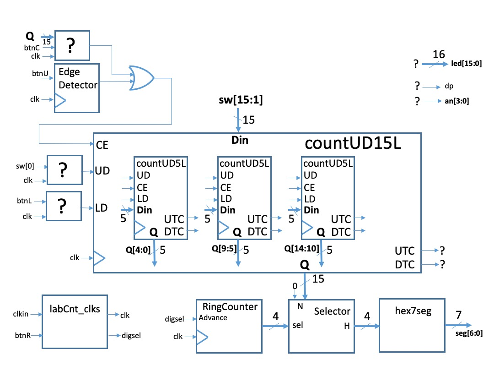

CSE100 Lab 3  
Martine Schlag  
Winter 24  
-----

**Demo due:** Tuesday January 30 end of your section

In this lab you will,

*   construct a sequential circuit using the library module FDRE.

In all of our labs from here on, your designs must be **synchronous with the system clock** specified in the lab. This means that you must

*   use only [positive edge-triggered flip-flops](https://classes.soe.ucsc.edu/cse100/Winter24/lab/FDRE/FDRE.html),
*   not use asynchronous clears or pre-sets of any sequential elements,
*   connect only **the system clock** (provided to you) to the clock input pins of any sequential components,
*   not connect **the system clock** to any input pins other than the clock input pins of sequential components, and
*   only use the **assign** statement in your design.

### Overview

In Lab 3 you will build

*   a 5-bit binary counter that counts up, down, and is loadable,
*   an edge-detector,
*   a ring counter to control the 7-segment displays,
*   a selector to choose one out of four 4-bit buses, and
*   re-use the 7-segment display module you created in Lab 2.

These parts will be assembled as below to build a 15-bit counter and display its content in hex on the four 7-segment displays.  
The leftmost LED (led\[15\]) will be lit when the 15-bit counter is at its highest value, hex 7FFF, and  
the rightmost LED (led\[0\]) will be lit when the counter is at its lowest value 0.  
The counter will behave as follows:

1.  each time pushbutton btnU is pressed, the counter will either increment or decrement by 1 based on sw\[0\],
2.  while pushbutton btnC is held down **except in the range 7FFC to 7FFF**. the counter will increment or decrement continuaously based on sw\[0\].

  
Incrementing at value 7FFF will result in 0000 and decrementing from 0000 will result in 7FFF.  
Your counter is also **loadable**: when pushbutton btnL is pressed the 15-bit input **Din** (connected to the switches sw\[15:1\] in the top level) will be loaded into the counter.

  
Figure 1: Overview of Lab 3 design.

Read all of the instructions below before beginning any design.

### Counter Design

Start by designing a 5-bit binary loadable counter **countUD5L** using the the [**FDRE**](https://classes.soe.ucsc.edu/cse100/Winter24/lab/FDRE/FDRE.html) , module that is part of the "built-in" Unisim library. Your 5-bit counter, **countUD5L**, should have 5 inputs:

*   the system clock,
*   UD (determines whether the counter will increment or decrement when CE is 1)
*   CE (increment or decrement depending on UD)
*   LD(load control)
*   the 5-bit vector Din that will be loaded on the clock edge if LD is high.

Your 5-bit counter has 3 outputs:

*   a 5-bit bus Q which is the current value held by the counter,
*   the signal UTC (Up Terminal Count) which is 1 only when the counter is at 5'b11111 (31 in decimal), and
*   the signal DTC (Down Terminal Count) which is 1 only when the counter is at 5'b0000.

Simulate your 5-bit counter before proceeding. Make sure it doesn't count when CE is low. Make sure it loads Din whenever LD is high regardless of CE. Make sure UTC is high only when the counter bits are all 1's and DTC is high only when the counter bits are all 0's. You will need a clock to simulate a sequential circuit such as a counter. You can borrow some of the lines from the Verilog code in the simulation step (below) to provide a clock.

Using a few gates connect three instances of your 5-bit counter to make a 15-bit counter as in the overview figure. Your 15-bit counter will have the same ports as the 5-bit counters except that its bit vectors will be 15-bit vectors. Its UTC output should be 1 when your 15-bit counter is at hex 7FFF. and its DTC output should be 1 when your 15-bit counter is at 0.

### Selector

Rather than using four **hex7seg** symbols, one for each digit, and merging their outputs (as we did in Lab 2), it is more economical to use only one of these symbols and feed it 4-bit values one at a time for each of the four digits. The **Selector** will have as input a 16-bit bus, **N\[15:0\]**, along with a 4-bit control input, **sel\[3:0\]**. Its output is a 4-bit bus, **H\[3:0\]** which is a 4-bit range of the **N\[15:0\]** bus.  
Specifically,
```
H is N[15:12] when sel=(1000)
H is N[11:8] when sel=(0100)
H is N[7:4] when sel=(0010)
H is N[3:0] when sel=(0001)
```

When more than one of the control inputs is high or they are all 0, the output H can be anything (Don't Care).

### Ring Counter

A ring counter holds a bit vector which has a single 1 bit. It has a control, **Advance**, along with a clock input. If Advance is high on the clock edge then the 1 bit shifts by one position circularly. You may use Flip-Flops (**FDRE** in the library) to implement it. Chapter 4 of the text has a section on "Registers" that describes the **Ring Counter**. You will need to make sure that one of the FFs has a 1 on reset. (In the text, this is accomplished by placing two inverters around one of the FFs.)

### Edge Detector

Pushbuttons btnU will be connected to the input of an **Edge-Detector**.  
An **Edge Detector** will generate a high value for one clock cycle if the past two inputs consist of a 0 followed by a 1. Design a small sequential circuit to implement the **Edge Detector**. You may use only FDRE Flip-Flops and combinational logic.

### Top Level Module

1.  Your top level should have the following inputs:
    
    *   clkin - this is the 100MHz clock on the BASYS3 Board
    *   btnR - this button will be connected the built-in global reset of the Artix 7 FPGA
    *   btnU - when pressed this button causes the counter to increment (if sw\[0\] is 1) or decrement(if sw\[0\] is 0) by just one
    *   btnC - when pressed this button causes the counter to advance continuously **except in the 7FFC to 7FFF range**
    *   btnL - when pressed this button causes the counter to load the value determined by the switches sw\[15:1\] on the clock edge
    *   sw - the left 15 bits vector determines the value loaded into the counter when btnL is pressed  
        and sw\[0\] specified the direction of the count (1 for increment, 0 for decrement)
    
    and should have the following outputs:
    
    *   seg - this 7 bit vector controls the segments in the 7-segment display,
    *   dp - this controls the dp segments in the 7-segment display,
    *   an - this 4 bit vector controls the 4 digits of 7-segment display,
    *   led\[15\] - this is the leftmost LED below the switches and should display UTC.
    *   led\[0\] - this is the rightmost LED below the switches and should display DTC,  
        (Set led\[14:1\] to 0 so that they will have a value.)
    
2.  In your top level, add and connect the modules for your **Edge Detector**, **Ring Counter**, **15-bit Counter**, **Selector** and **hex7seg**. You will need to provide logic so that depressing btnC does not advance the counter when it is in the range 7FFC to 7FFF.
    
3.  Connect the clock inputs of the Edge Detector and Counters to a net named **clk**.  
    This is the **system clock** for the design. It is the only signal which can be used as a clock in your design.
    
4.  Download [this verilog file](labCnt2_clks.v) and save it as **labCnt\_clks.v** in your project directory.
    
5.  In the Vivado Project Manager, add it to your project. Make sure you select the option to copy it into your project.
    
6.  Add an instance of the module **labCnt\_clks** to your top level as follows:  

    ```verilog
    labCnt_clks slowit (.clkin(clkin), .greset(btnR), .clk(clk), .digsel(digsel));
    ```
    
    The signal **clk** is your system clock. The signal **digsel** should be used to advance the Ring Counter; it should not be used as a clock!!!  
    Pushbutton btnR should be connected only to the .greset input of labCnt\_clks, no where else!
    
7.  Edit the constraint file. You'll need to setup the clock as in Lab 2 (the external clock is labeled "clkin" ) and uncomment the lines for the inputs/outputs we are using.
    
8.  Implement your design. Even if you are not ready to download the bitstream to the board, running these two last steps, **Implement and Generate Bitstream**, can catch errors that may be more difficult to find through simulation.
    
9.  Simulate your design.
    
    a.  Providing values for the input **clkin** yourself would be tedious. Instead copy and paste the following text into your Verilog Testbench to generate a periodic signal for **clkin**.
    
    ```verilog
    parameter PERIOD = 10;
    parameter real DUTY_CYCLE = 0.5;
    parameter OFFSET = 2;

    initial    // Clock process for clkin
    begin
        #OFFSET
            clkin = 1'b1;
        forever
        begin
            #(PERIOD-(PERIOD\*DUTY_CYCLE)) clkin = ~clkin;
        end
    end
    ```
            
        
    b.  In the testbench add values for your pushbuttons and vary them over time. Advance time by a multiple of 100ns between changes.  
        The **clk** will only become active after 1000ns, so advance time by at least that amount before varying any inputs. Make sure pushbutton btnC is high and low for multiple consecutive clock cycles in your testbench. Pushbutton btnU should also to held high for multiple clock cycles. You will want to add the 15-bit bus output of your counter to the Waveform Viewer.
    
    c.  Before attempting to demo your design please also simulate the following [verilog testbench](testTC.v) that verifies your UTC goes high (at about 1.3ms), stays high and then returns low as required, and also that the counter loads properly even whenthe CE input is high. After simulating this testbench for 1.4ms, check the value of TX\_ERROR; it should still be 0.  
        (The TA will be annoyed if they spend the 40 seconds to discover that your TC/design is not working and you have not simulated this testbench.)
    
10.  Implement your design, configure the FPGA and demonstrate your design and simulation to the TA.
    
11.  Remember to [archive](https://classes.soe.ucsc.edu/cse100/Winter24/lab/archive/archive.html) your project. Files left on the PC are not 100% guaranteed to reappear when you login next time.
    
12.  **Important** Please remember to turn off the power to the BASYS3 board when you are done.