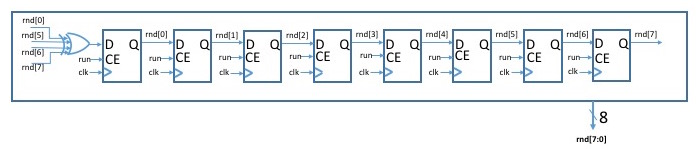

CSE 100/L Lab 4  
Stop It  
Martine Schlag  
Winter 2024
--------------------------------------------------------

**Prelab due:** Tuesday February 6 9am PST.

**Demo due:** Thursday February 8 end of your section.

**Write-Up due:** Friday February 16 Canvas at 11:55pm.

In this lab you will implement a state machine as part of a sequential circuit for a game called _Stop It_.

Be sure to complete the [Prelab](https://classes.soe.ucsc.edu/cse100/Winter24/lab/lab4/prelab4.html) so that you can simulate your state machine and components.  
If you haven't already viewed the video in Yuja on using the simulator in Vivado ("Simulation Example") you will want to do that now.  
It steps through simulating a multiplexor from creating the testbench to tracking down errors.  
When simulating your state machine you will want to add the state bus to your waveform viewer.  
When you ask for help in the lab, the first question that will be asked is whether you have a simulation showing the error.  
If you are having trouble running the simulator ask for help.

Remember that your design must be synchronous with **the clock** signal specified in this lab. This means that you must

*   use only [positive edge-triggered flip-flops](https://classes.soe.ucsc.edu/cse100/Winter24/lab/FDRE/FDRE.html),
*   not use asynchronous clears or pre-sets of any sequential elements,
*   connect only **the system clock** provided to you to the clock input pins of any sequential components,
*   not connect **the system clock** to any input pins other than the clock input pins of sequential components, and
*   and only use the **assign** statement in your design.

### Overview

You will use the BASYS3 board to implement the following reaction/estimation single player game in which a 5-bit counter counting down is displayed and the player tries to stop it at a specified value.

1.  At the start of each round the game counter is displayed on the rightmost two digits of the BASYS3 7-segment display. The left two digits are off.
2.  A Go signal is given (pushbutton btnC is pressed) to start the next round.
3.  In each round, a random 5-bit binary value, the target number, is selected and displayed on the two leftmost digits and the 5-bit game counter (still displayed on the rightmost digits) is set to 1F.
4.  After 2 seconds the game counter begins to decrement every quarter second.
5.  The game counter will keep decrementing, rolling under to 1F(31 decimal), from 0.
6.  When the "stop" signal is asserted (pushbutton btnU) the game counter stops decrementing.
7.  At this point if the value of the counter matches the target number, then all 4 display digits flash for four seconds in unison.
8.  If the value of the counter does not match the target number, then all 4 display digits flash for four seconds, with the target number and game counter digits alternating as they flash.
9.  The flashing continues for four seconds and then the leftmost digits are again blank and a new round can begin with a Go signal.
10.  Each time the player succeeds in matching the target, one more led lights up beginning with the rightmost.
11.  If all 16 leds are lit, and the target number was matched, then the game has been won. After the digits flashes for 4 seconds, all 16 leds flash, and no button, except btnR will have an effect.
12.  To make the game easier to win (without 17 matches!), pressing btnL will be a cheat switch that will load the switches into the leds (or actually the shift register holding the values of the leds).

https://github.com/zura3395/cse100/assets/68401942/97c4827a-0426-4e58-a2a0-976d0078d267

On the BASYS3 board,

*   PushButton btnC will be used as the Go signal.
*   PushButton btnU will be the "stop" signal
*   PushButton btnL will load the switches into the led state
*   PushButton btnR will be used as global reset (as usual) and should only be connected to the module **qsec\_clks** described below. used to stop the game counter.
*   You will be given a clock **clk** and a signal **qsec** which is **high for one clock cycle** every 1/4 of a second. The signal **qsec** should **NOT** be used as a clock. It can be connected to count enable inputs possibly with other logic to control the rate at which a counter advances, and to a counter to make a score flash.

Below is the block diagram of your entire system; it has three pushbuttons and the BASYS3 clock (**clkin**) as inputs, and the outputs are for the 7-segment displays and leds.  
(The BASYS3 clock **clkin** and global reset **btnR** are inputs of your top level, but will not be part of your logic. They will connect only to **qsec\_clks**.)


### Random Number Generator

You will use a Linear Feedback Shift Register (LFSR) to generate a random 8-bit binary number. Below is an 8-bit linear feedback shift register. This LFSR is simply an 8-bit shift register where the input to the first register is the XOR of specific bits in the register. If all the bits in the registers are 0 then the LFSR output will always be 0's. But otherwise it will go through a sequence of all 255 non-zero states before it repeats. This sequence is not random, but reading the LFSR at random times (assuming it cycles through enough states fast enough) will give you a random 8-bit number in the same way a roulette wheel provides a random outcome. The choice of inputs into the XOR gate is not arbitrary so be sure to use the inputs exactly specified in the figure.  
To avoid waiting as long as a minute for the Game Counter to reach a target number, we are using only 5 bits from the LFSR as the target number. But you still need the 8-bit linear feedback shift register. The run input advances the LFSR at every clock edge. When it is low, the LFSR will hold its value.



### Game Counter

You will need a counter that can be reset and can count up (hmm, maybe from a recent lab ?).

### Time Counter

You will need a counter that can be reset and can count up (hmm, maybe from a recent lab ?).

### Display

You will need to display the target number as well as the Game Counter and make them flash appropriately depending on the game state. You can control whether a digit of the display is on or off and make it flash by providing appropriate logic for its AN output.

### Led Display

The LEDs can be controlled using a 16-bit shift register with the Shift signal. Each time the target is matched, a 1 will be shifted in. There is also a parallel load input (LD) to load a 16-bit bus. The Off signal, which forces the LED\_Shifter output low, is useful for making the LEDs flash.

### State Machine

In the overview diagram there is a block for the state machine you must build. (You may decide you want additional inputs and/or outputs.) Start by drawing a state diagram. Make sure you cover all cases for each state.

Note that the inputs from the pushbuttons (btnU, btnC, and btnL) **are not synchronized** with your clock (they are asynchronous). You should pass these inputs through a syncronizer (D Flip-Flop) before using them in your circuit.

**Gratuitous Advice:** Getting a state machine right usually requires several iterations. It is likely that in demonstrating your design the TA will discover some case that is not properly handled. Often changes to the state machine are not simple. A complete redesign may be necessary. Trying to patch it by changing one signal here or there, or inserting a gate/FF, or more, almost always makes things worse. Please leave yourself enough time. Hurrying will introduce more bugs that you will need to hunt down. It is strongly suggested that your entire design be entered and simulating **before** your second section.

### Instructions

1.  Read all of the instructions below before beginning any design.
    
2.  Read [entering a state machine](https://classes.soe.ucsc.edu/cse100/Winter24/lab/fsm/fsm.html) with Verilog.
    
3.  Make the modules for your components and if they have flip flops make sure they initialize to the appropriate values. For example, your LFSR should **not** start with the contents 00000000 when the global reset is asserted (not GO). Since the global reset (which we will connect to btnR below) resets all flip-flops to 0 you will need to arrange for at least one of the bits to be 1 on the global reset.
    
4.  Draw a state diagram for your state machine, obtain the next state and output logic equations. You'll want to use one-hot encoding.
    
5.  Enter the logic for your next state and output equations using the **assign** statement and provide flip-flops to hold the present state.  
    Remember that the global reset will reset all flip-flops. Make sure this will put your state machine into its desired initial state.
    
6.  Simulate your state machine. It is much easier to catch problems when you control the FourSecs and TwoSecs signals rather than waiting many clock cycles for it in the simulation of the whole design.
    
7.  In your top level, connect your state machine, LFSR, counters, 16-bit LED shifter, the inputs and outputs, and anything else you need. Create a net named **clk**, connect it to the clock input of your state machine, LFSR, counters and any other sequential components. This is the **system clock** for the design. It is the only signal which can be used as a clock in your design and it should not be connected to anything other than a clock input.
    
8.  Download [this verilog file](qsec_clks.v) and save it as **qsec\_clks.v** in your project directory.
    
9.  In the Vivado Project Manager, add it to your project. Make sure you select the option to copy it into your project.
    
10.  Add an instance of the module **qsec\_clks** to your top level as follows:  

        ```verilog
        qsec_clks slowit (.clkin(clkin), .greset(btnR), .clk(clk), .digsel(digsel), .qsec(qsec));
        ```  

        The signal **clk** is your system clock. The signal **digsel** should be used to advance the Ring Counter for the 7-segment displays; it should not be used as a clock!!!  
        The signal **qsec** is high for one clock cycle each 1/4 second (4 times per second) and should be used to advance the Time Counter; **it should not be used as a clock!!!**
    
11.  Simulate your entire design.  
    You will need to implement a clock in your test fixture. The signals **qsec** and **digsel** will be high every 16th cycle of **clk** during simulation. They are much faster during simulation than when implemented so that less time must elapse during simulation.  
    You should simulate until the signals from your timer go high to make sure your State Machine and the Time counter are working properly together.
    
12.  Implement your design, configure the FPGA and demonstrate your design to the TA.
    
13.  Once your working design has been demonstrated, follow [these directions](https://classes.soe.ucsc.edu/cse100/Winter24/lab/submit.html) to submit your project. The zipped project file must be submitted by the due date of the write-up.  
    (You can continue to improve your project for the write-up if desired, but you should submit the version you demonstrated.)
    
14.  Remember to [archive](https://classes.soe.ucsc.edu/cse100/Winter24/lab/archive/archive.html) your project. Files left on the PC are not protected.
    
15.  **Important** Please remember to turn off the power to BASYS3 board when you are done.

### Write-Up

See [Lab Write-Up](https://classes.soe.ucsc.edu/cse100/Winter24/lab/writeup.html) for instructions on what to include in the written report and how to submit electronically.  
In the report for Lab 4, be sure to:

*   Include your state diagram, next state and output logic equations.  
    The diagram can be hand drawn or drawn using with a program(aka app).
    
*   Describe each state of your machine in words.  
    Example: "The machine is in state COUNTDW while the Game Counter is counting down. It stays in this state until the stop signal (btnU) is high."
    
*   For the appendix you will need to provide screenshots of the Waveform Viewer showing simulation results for each of the scenarios below.  
    The following input and output signals should be included: clk, btnR, btnU, bntC, btnL, sw\[\], led\[\], as well as the LFSR contents, the Time Counter, the state bits of the State Machine. Display buses as buses in hex.  
    a.  Player pressing btnU and matching the target.  
    b.  Player pressing btnU and not matching the target.  
    c.  btnL loading the leds for the switches.(You may make one test bench and simply screenshot the different sections for each of the scenarios.)

The following supplementary material for Lab 4 should be submitted electronically as appendices in your report **within the one PDF file (not in separate files)**.

1.  Print-outs of all of your schematics for the modules.
2.  A print-out of all of your Verilog source code.
3.  A print-out of the Waveform Viewer showing your simulation results.
4.  The scanned notebook pages for this lab.

**Don't forget to submit the zipped project file!** The zipped project file must be submitted by the due date of the write-up.
