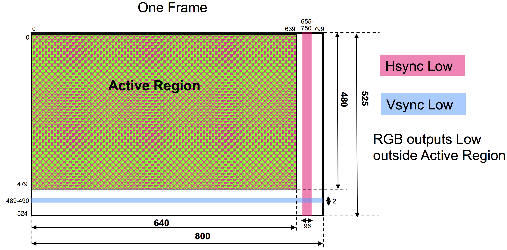

CSE100/L Lab 6  
Subway Slugging  
Martine Schlag  
Winter 24  
--------------------------------------------------------

**Demo due:** Thursday March 7, 2024 end of your section

**Write-Up due:** Friday March 15, 2024 11:55pm

There are [two opportunities](lab6-ec.md) to earn extra credit points towards the lab demo portion of your CSE 100 grade.

**Description:**

You will design and implement a version of the game "Subway Slugging" using the BASYS3 board and the VGA monitor connected to it. In this game, a slug must avoid trains traveling down tracks by jumping between the three tracks or hovering above the middle track. A collision with a train ends the game and the number of trains the slug has avoided is the score. The slug can only hover for a limited time. Once the slug's energy level, displayed on the left, reaches 0 the slug will drop.

Initially, the slug and the energy level bar are displayed, but no trains are present. The score, initially 0, is displayed on AN1 and AN0. Pressing btnC starts the game. No other pushbutton has an effect before the game starts (except the global reset, btnD, of course). When the game starts the trains will start traveling down the tracks and pressing btnL/btnR slides the slug one track to the left/right. If the energy level is not 0 and the slug is in the middle, then the slug will hover while btnU is pressed. But hovering will use up energy. The slug will drop as soon as btnU is released or the energy level is down to 0. The slug should change color and flash while it is hovering. While the slug is not hovering the energy level increases. Each time a train passes the slug, a point is scored. A crash occurs if the slug is not hovering and overlaps a train. A crash ends the game, and when the game is over, the slug and all trains stop moving, and the slug flashes. Only the global reset, btnD, will have an effect when the game is over. Switch sw\[3\] will be a cheat switch that makes the slug immortal: it can go through trains without crashing.

### VGA controller

Read the section on the **VGA Port** in the [BASYS3 Board Reference Manual](https://reference.digilentinc.com/reference/programmable-logic/basys-3/reference-manual#vga_port)  
**But do not use the circuit design shown there: it is asynchronous.**

To control the monitor you must generate two control signals, **Hsync** and **Vsync**, as well as the 12 RGB data signals (vgaRed\[3:0, vgaBlue\[3:0\], vgaGreen\[3:0\]) for each of the screen's 640 x 480 pixels. The value of these 12 signals are sent one at a time for each pixel, row by row from left to right and top to bottom using one cycle of the 25MHz clock (provided to you) for each pixel. There is also some time between rows and between frames (after all 480 rows) which allows the cathode ray to be re-positioned for the next row or frame. The Hsync and Vsync signals are used by the monitor to "synchronize" the start of each row and frame; they are low at fixed times between rows and frames. (_Yes the monitors we will use are lcd displays, not cathode ray tubes. But the protocol used to communicate with these monitors is a standard that lives on._)

One way to think of this is to imagine that you have an 800 x 525 grid of pixels as shown below (instead of the 640 x 480 pixels which correspond to the area you see on the monitor). This grid is traversed starting at the top left, location row 0, column 0. Each row is traversed from left to right followed by the row immediately below it and so on. The region of dimension 640 x 480 at the top left is the **Active Region**: the pixels in this region corresponds to pixels on the screen. The pixels outside this region correspond to time where the cathode ray would be off the screen. So the L-shaped region outside the active region is not part of the screen but represents the time needed between rows and frames in terms of pixels. The value of the RGB data signals determine the color displayed for pixels in the Active Region, with one cycle of the 25MHz clock corresponding to a pixel. For a pixel outside the Active Region the 12 RGB data signals should be low. The horizontal synchronization signal (Hsync) should be low **exactly** for the 96 pixels in each row starting with the 656th pixel and high for the rest. The vertical synchronization signal (Vsync) should be low **exactly** for all of the pixels in the 490th and 491st rows and high for all pixels in all other rows. So Hsync and Vsync are low in only the regions shaded pink and blue below, respectively.  
  
The frame is continuously transmitted to the monitor to refresh the image. Transmitting one frame takes 800 x 525 x 40ns = 16,800,000ns = 16.8ms, so the monitor is being refreshed roughly 60 times per second: at 60Hz.

### Game Requirements

1.  The playing area is the 640 x 480 screen.
2.  The border along all 4 edges of the screen is white and 8 pixels wide.
3.  The green bar indicating the slug's energy level is near the left border. It is 20 pixels wide and 192 pixels long at the maximum energy level.
4.  There are three vertical tracks that are each 60 pixels wide. They are not visible unless you choose to display them. But the trains that will descend along these tracks will be visible.
5.  The tracks should be positioned in the right 2/3's of the screen with 10 pixels between adjacent tracks.
6.  The slug is a 16 by 16 pixel yellow square (or a shape that fits in this square and touches all 4 sides of the square). The top edge of the slug is in row 360 and the slug is initially in the middle of the middle track.
7.  The slug cannot move or change until the game starts (btnC is pressed).
8.  Pressing btnC will start the game, but once the game is started btnC has no further effect.
9.  During the game, the slug is either at rest, centered on one of the three tracks, or transitioning between two adjacent tracks.
10.  Pressing btnR starts the transition to the adjacent track on the right (unless the slug is on the rightmost track).
11.  Pressing btnL starts the transition to the adjacent track on the left (unless the slug is on the leftmost track).
12.  The slug will move horizontally at 2 pixels per frame while it is transitioning.
13.  Once a transition has started it will continue unless the game ends (a crash occurs).
14.  Pressing btnL or btnR during a transition or while the slug is hovering has no effect.
15.  Holding btnU down while the slug is centered on the middle track and its energy level is not 0 will cause the slug to hover.
16.  The slug changes color and flashes while it is hovering.
17.  When btnU is released or the slug's energy level reaches 0, the slug stops hovering.
18.  While the slug is hovering its energy decreases level by 1 every frame down to 0.
19.  While the slug is not hovering its energy level increases by 1 every frame up to a maximum of 192.
20.  Each track will has two trains.
21.  Pressing btnC opens the three tracks in the following order: the left track is first, followed by the right track 2 seconds later, and finally the middle track 6 seconds after the right track.
22.  When a track is opened, its first train with start.
23.  When a train starts, it will pick a random length, wait a random amount of time, and then descend at one pixel per frame until it is completely off the screen.
24.  Trains are 60 pixels wide.
25.  When the bottom of either train reaches row 400 (440 for the middle track) the other train will start in the same manner: picking a random length and waiting a random time before descending.
26.  The two trains continually move down their track, restarting each other until the game ends.
27.  When the top of the train reaches the row below the slug, a point is scored.
28.  The length of the train is 60 + B pixels where B is a randomly selected number between 0 and 63.
29.  The random amount of wait time before descending is T frames where T is a randomly selected number between 0 and 127.
30.  A crash occurs whenever the slug is not hovering and it overlaps any train by at least 1 pixel.
31.  If a crash occurs, the game is over: the trains stop moving, the slug stops moving and flashes, and only btnD can have an effect.
32.  When the game is over, pressing btnD will start a new game.

### Project Requirements

1.  Your design must be synchronous with the system clock provided. The same rules apply as in previous labs to assure that your design is synchronous with **the system clock** signal specified in this lab. This means that you must
    
    *   use only [positive edge-triggered flip-flops](https://classes.soe.ucsc.edu/cse100/Winter24/lab/FDRE/FDRE.html),
    *   not use asynchronous clears or pre-sets of any sequential elements,
    *   connect only **the system clock** provided to you to the clock input pins of any sequential components,
    *   not connect **the system clock** to any input pins other than the clock input pins of sequential components, and
    *   and only use the **assign** statement in your design.
    *   **You may use arithmetic and comparisons within the expressions** you assign, but no conditionals. (This can be tricky because of sign issues. Make sure you have enough bits and avoid subtraction.)
    

### Specific Instructions

1.  Start now. You will not be able to complete this lab in just a few days. It will take several days to debug and you will need to download and see your design's output on the monitor to debug it.
    
2.  Download [this Verilog file](labVGA_clks.v) and save it as **labVGA\_clks.v**. In the Vivado Project Manager, add it to your project. Make sure you select the option to copy it into your project.
    
3.  Add an instance of the module **labVGA\_clks** to your top level as follows:  
    
    ```verilog
    labVGA_clks not_so_slow (.clkin(clkin), .greset(btnD), .clk(clk), .digsel(digsel));
    ```
    
    **Note that btnD will be used for the global reset, since btnR has another purpose in this lab.** The signal **clk** is your system clock. The signal **digsel** should be used to advance the Ring Counter for the 7-segment displays; it should not be used as a clock!!!  
    When you simulate with labVGA\_clks, the clk signal will have the same timing as on the board: it is a 25MHz clock. Only the signal digsel will be different.
    
4.  Map out your components (figure out their inputs/outputs and what they do) but don't implement them yet.
    
5.  After implementing your Hsync/Vsync signals and your pixel address counters, you should simulate your design using [this testbench](test3.v). Follow the instructions in the comments at the top. This testbench will check that your Hsync and Vsync signals are correct and that your RGB outputs are low outside the active region. You should do this **before** adding too much other logic to your design since it will take a while just to simulate one frame even for a simple design in which the screen is just one solid color.
    
6.  **Incremental design is highly recommended.** This means implementing and testing your design in phases. A good first step is to implement a VGA controller that outputs the Hsync and Vsync signals, and provides the pixel address and indicator for the active region while displaying a single color. (You should test your design using the testbench mentioned in the previous step at this point rather than continuing.) Then work on the borders. Then display the slug, the energy level bar. Then make the energy level bar decrease/increase based on whether btnU is pressed. (This is sufficient to earn Bonus 1).
    
    Next you can make the slug respond to btnL, btnR, and btnU. You will need a state machine to make it transition, and hover only when it is on the middle track. You'll need to coordinate the hovering and the energy level bar.
    
    Next you should work on **one** track. Please make a separate module for a track. You can start by testing just one and when it is working perfectly, then and only then you should instantiate the other 2 (with different inputs). **But first get one track working perfectly before evening thinking about other two.** This is the most complicated component.
    
    The last piece is to instantiate the other two tracks, and provide a top level state machine to start the tracks, the slug, and end the game when there is a crash. You'll need a timer for the staggered track opening and to make things flash.
    
7.  To move objects at one pixel per frame and count once per frame you will need a signal **frame** that is high for one clock cycle once per frame. A simple way to generate this signal is to edge detect the Vsync signal since it has a single low pulse in each frame. Another way is to make a signal that is high at one specific pixel address. Which ever way you choose, it's important that this signal not be high in the active region to avoid updating the position of an object while it is being displayed.
    
8.  There is no **qsec** signal provided for this lab. Do not try to use the **qsec\_clks**. Instead the "frame" signal mentioned above which is high for one cycle per frame can be used as the up (or down) input of a counter. Counting up to 60 would be one second and 64 is close enough for our purpose.
    
9.  Since you can only simulate a few frames with the simulator, you will need feedback from the monitor to understand what is occurring. If you are not seeing anything on the monitor or the image is not stable, then you will want to check the timing of your Hsync, Vsync and RGB signals. (See step 5 above.)
    
10.  If you need to simulate your design to see how your objects interact you will want to generate your own **frame** signal in the test bench rather then waiting 420,000 clocks for it to go high. You may find it useful to display certain signals on the leds, or values on the 7 segment display. You can use the switches to force certain conditions. In the video above, when sw\[0\] is high, AN1 and AN0 display how many molecules of each type are currently on the right side of the membrane.
    
11.  At some point you might suspect that either your BASYS3 board or the monitor is not functioning properly. To convince yourself that this is not the case, you can download the bitfile [testvgaB3.bit](testvgaB3.bit) to the board. This will also allow you to check that the VGA, buttons, switches, leds and 7-segment displays are working.
    
12.  Implement your components and state machine. You may use any component that you have built for your previous CSE100 labs. As usual you may only use the assign statement. No conditionals. **But in this lab you may use arithmetic and comparisons within these expressions.** Be careful. This can be tricky because of the precision and sign issues.
    
13.  Demonstrate your working Subway Slugging game to the TA/Tutor/Instructor.
    
14.  Follow [these instructions for obtaining Timing Report.](https://classes.soe.ucsc.edu/cse100/Winter24/lab/timing_report/Timing_Report.html) Open the "Timing Summary Report" and use the information there to calculate the maximum frequency at which your design can run. Submit the timing report as part of your write-up.
    
15.  Remember to [archive](https://classes.soe.ucsc.edu/cse100/Winter24/lab/archive/archive.html) your project. Files left on the PC are not protected. Should it become necessary to re-image a PC, its disks will be wiped clean.
    
16.  **Important** Please remember to turn off the power to the BASYS3 board when you are done.

### Write-Up

See [Lab Write-Up](https://classes.soe.ucsc.edu/cse100/Winter24/lab/writeup.html) for instructions on what to include in the written report and how to submit electronically.  
  
Your write-up for Lab 6 should also include:

*   The major components of your design and their function. (Include a state diagram for any state machines.)
*   A description of how these components interact.
*   Describe each component's function and how you implemented it (if you did) or how you use it.
*   The maximum clock frequency (MHz) at which your design will operate based on the Timing Report.

The following supplementary material for Lab 6 should be submitted electronically as appendices in your one PDF file:

1.  Print-outs of all of your Verilog modules.  
    You may omit the modules of any multiplexor/counter/selector modules from your previous CSE 100 labs that you are reusing (without change).
2.  A print-out of all of your Verilog testbenches.
3.  One screenshot of simulation in which the Vsync (vertical synch signal) goes low. The vertical counter should be displayed so that it is clear the Vsync signal is low in the correct rows.
4.  The Timing Summary Report (just the Design Timing and Clock Summary pages).
5.  The scanned notebook pages for this lab.

**Don't forget to submit the zipped project file** following [these directions](https://classes.soe.ucsc.edu/cse100/Winter24/lab/submit.html). The zipped project file must be submitted by the due date of the write-up.
